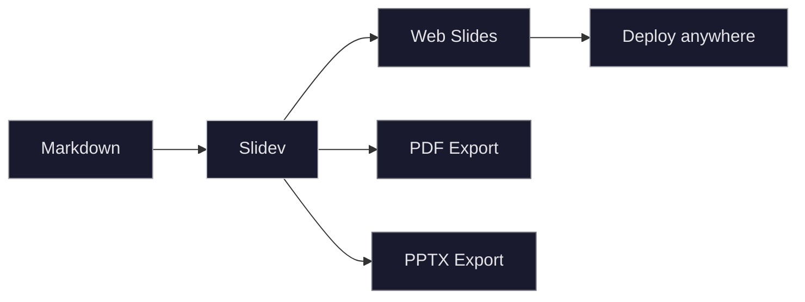

# Slidev Example Deck

A tour of what you can do

<div class="abs-br m-6 flex gap-2">
  <a href="https://github.com/slidevjs/slidev" target="_blank" class="text-xl slidev-icon-btn opacity-50 !border-none !hover:text-white">
    <carbon-logo-github />
  </a>
</div>

---
transition: fade-out
---

# Code Blocks

Syntax highlighting with Shiki, line highlighting, and line numbers

```python {2-3|5-6|all} {lines:true}
import numpy as np

def gradient_descent(f, grad_f, x0, lr=0.01, steps=100):
    x = x0
    for _ in range(steps):
        x = x - lr * grad_f(x)
    return x

minimum = gradient_descent(
    f=lambda x: x**2,
    grad_f=lambda x: 2*x,
    x0=5.0,
)
```

Click through to see line highlighting in action →

---

# Multiple Languages

<div class="grid grid-cols-2 gap-4">

```rust
fn main() {
    let nums: Vec<i32> = (1..=10)
        .filter(|x| x % 2 == 0)
        .collect();
    println!("{:?}", nums);
}
```

```go
func main() {
    nums := []int{}
    for i := 1; i <= 10; i++ {
        if i%2 == 0 {
            nums = append(nums, i)
        }
    }
    fmt.Println(nums)
}
```

</div>

Side-by-side code blocks using a CSS grid layout.

---

# LaTeX & Math

Slidev supports $\KaTeX$ for rendering math expressions.

Inline math: $E = mc^2$, and $\nabla \cdot \mathbf{E} = \frac{\rho}{\epsilon_0}$

Block equations:

$$
\int_{-\infty}^{\infty} e^{-x^2} dx = \sqrt{\pi}
$$

$$
\mathcal{L}(\theta) = \sum_{i=1}^{n} \left[ y_i \log h_\theta(x_i) + (1 - y_i) \log(1 - h_\theta(x_i)) \right]
$$

$$
i\hbar \frac{\partial}{\partial t} \Psi = \hat{H} \Psi
$$

---
layout: image-right
image: /images/demo.svg
---

# Images

Images go in the `public/` or project directory.

Use layouts like `image-right`, `image-left`, or set full background images.

You can also use standard markdown:

```md

```

Or set a slide background:

```yaml
---
layout: cover
background: /images/demo.svg
---
```

---

# Styling & Theming

<div class="grid grid-cols-2 gap-8">
<div>

### UnoCSS Utilities

<div class="p-4 rounded-lg bg-zinc-500/10 border border-zinc-500/20 mt-2">
  <p class="text-zinc-300 font-mono text-sm">Styled with utility classes</p>
</div>

<div class="p-4 rounded-lg bg-zinc-500/10 border border-zinc-400/20 mt-2">
  <p class="text-zinc-300 font-mono text-sm">Colors, spacing, borders</p>
</div>

<div class="p-4 rounded-lg bg-zinc-500/10 border border-zinc-400/20 mt-2">
  <p class="text-zinc-300 font-mono text-sm">Fonts, opacity, layout</p>
</div>

</div>
<div>

### Available Themes

- `seriph` — clean, elegant
- `default` — minimal
- `apple-basic` — Apple keynote style
- `dracula` — dark theme
- `academic` — for papers

Set via frontmatter:

```yaml
---
theme: seriph
---
```

</div>
</div>

---
layout: two-cols
layoutClass: gap-8
---

# Lists & Fragments

Items appear one at a time:

<v-clicks>

- First point
- Second point
- Third point
- Fourth point

</v-clicks>

::right::

# Tables

| Feature | Supported |
|---------|-----------|
| Markdown | ✓ |
| Code highlighting | ✓ |
| LaTeX / KaTeX | ✓ |
| Images | ✓ |
| Themes | ✓ |
| Animations | ✓ |
| PDF export | ✓ |
| Mermaid diagrams | ✓ |

---

# Mermaid Diagrams



---
layout: center
class: text-center
---

# Fin

[Slidev Documentation](https://sli.dev) · [GitHub](https://github.com/slidevjs/slidev)
